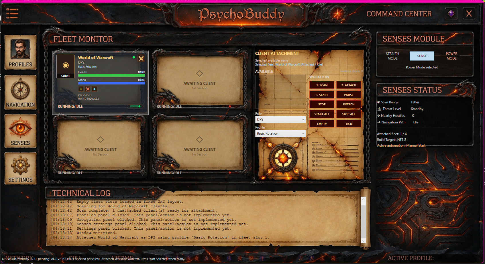

# 🧠 PsychoBuddy



**PsychoBuddy** is a source-available, in-development WPF/.NET 8 command-center prototype for a World of Warcraft multi-client automation platform.

> **Current status:** `PsychoBuddy.exe` does build and launch. The dashboard shell, scan/attach workflow, fleet slots, technical log, window chrome, icon, and first UI skin pass are working. The project is still under active development and is **not** a complete/fully working bot platform yet.

---

## ✅ Current Working State

The current build supports the following dashboard-level behavior:

- .NET 8 / WPF application startup through `src/App.xaml`.
- Custom `PsychoBuddy.exe` icon from `assets/PsychoBuddy.ico`.
- Canvas/Viewbox UI shell based on `assets/UI_Option_1_5.png`.
- Invisible hitboxes over artwork-provided buttons.
- Four fixed Fleet Monitor slots.
- Empty/offline startup slots.
- Client scan for running WoW windows.
- Attach selected client into the first available fleet slot.
- Detach client back to an empty/offline slot.
- Start / Pause / Stop selected client.
- Start All / Stop All attached clients.
- Power/Stealth mode toggle UI state.
- Selectable/copyable technical log.
- Placeholder feedback for Profiles, Navigation, Senses, Settings, and Menu buttons.

## 🚧 Still In Development / Not Fully Working Yet

The following are currently placeholders, scaffolds, or research-backed plans rather than finished production features:

- Real profile loading from disk.
- Real Settings page and `settings.json` persistence.
- Real Navigation page/pathing implementation.
- Real Senses configuration page.
- Real Power Mode memory signatures/offset resolution.
- Real Stealth Mode Lua addon + capture pipeline.
- Real class rotation profile system.
- Real role coordination behavior beyond current scaffolding.
- Final `UI_Option_1.png` cosmetic polish.

---

## 🛠️ Tech Stack

- **Framework:** .NET 8 / `net8.0-windows`
- **UI:** WPF
- **Application entry point:** `src/App.xaml` + `src/App.xaml.cs`
- **Dashboard window:** `src/UI/MainWindow.xaml`
- **Theme resources:** `src/UI/Themes/PsychoTheme.xaml`
- **Primary project file:** `PsychoBuddy.csproj`
- **Canonical source folder:** `src/`
- **Current shell artwork:** `assets/UI_Option_1_5.png`
- **End-goal UI reference:** `assets/UI_Option_1.png`

---

## 🚀 Clone → Build → Run

### 1. Clone the repository

```bash
git clone https://github.com/Psycho-core/PsychoBuddy.git
cd PsychoBuddy
```

### 2. Install requirements

Install **Visual Studio Community** with the workload:

```text
.NET desktop development
```

Confirm .NET 8 SDK/runtime components are installed.

### 3. Open the project

Open this file in Visual Studio:

```text
PsychoBuddy.csproj
```

Do **not** use any old `PsychoBuddy-Built` folder. That was only a temporary test-build copy and has been removed.

### 4. Build

In Visual Studio:

```text
Build → Rebuild Solution
```

Expected successful result:

```text
Build: 1 succeeded, 0 failed
```

Output path:

```text
bin/Debug/net8.0-windows/PsychoBuddy.exe
```

### 5. Run

For dashboard/UI testing, you can run normally from Visual Studio.

For memory-based Power Mode testing later, run as Administrator.

### Common build issue: file locked

If you see errors such as:

```text
MSB3021 / MSB3026 / MSB3027 / MSB3061
PsychoBuddy.exe is locked by another process
```

Close the running PsychoBuddy window, press **Stop Debugging** in Visual Studio, or end `PsychoBuddy.exe` in Task Manager, then rebuild. The project also includes a Debug-build guard that attempts to close old `PsychoBuddy.exe` instances before building.

---

## 🧭 Current Dashboard Workflow

```text
Scan Clients → Choose Role/Profile → Attach → Start/Pause/Stop → Detach
```

Current fleet behavior:

- No clients attached: four empty/offline fleet slots are shown.
- Attach selected client: fills first available empty slot.
- Detach selected client: returns that slot to empty/offline.
- Online/offline state: compact green/red status indicator on each card.

---

## 🎮 Target WoW Versions

PsychoBuddy research/data currently targets:

- **Legion 7.3.5**
- **Battle for Azeroth 8.3.7**

---

## ⚠️ Rules & Disclaimers

### 🚫 Prohibited Use

**Use of PsychoBuddy on official Blizzard Entertainment servers is strictly prohibited.**

This software is intended only for:

- approved private/local testing environments
- personal/local research servers
- development and educational research

### ⚖️ Liability & Risk

- Botting is against the Terms of Service of most game servers.
- No automation tool is guaranteed safe or undetectable.
- The author is not liable for bans, suspensions, account loss, data loss, or other damages.
- Use at your own risk and only where permitted.

---

## 📜 License

All original source code and logic are the proprietary intellectual property of **[Psycho-core]**.

The canonical license file is:

```text
LICENSE.MYCODE.txt
```

Commercial use, unauthorized distribution, or charging for access to the source code is strictly prohibited.
